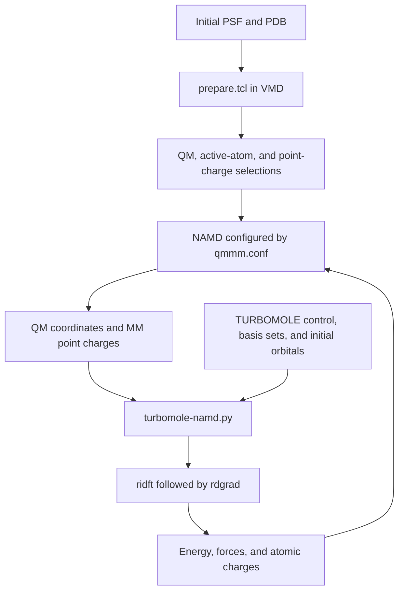

# TURBOMOLE–NAMD QM/MM Tutorial

This tutorial describes a general workflow for electrostatically embedded QM/MM calculations using NAMD and the `turbomole-namd.py` interface to TURBOMOLE. It covers input preparation, region definitions, electronic-structure settings, execution, and result validation.

NAMD manages the molecular topology, QM/MM boundaries, classical interactions, and geometry updates. TURBOMOLE evaluates the embedded QM energy and gradients. The Python interface translates the input and returns energies, forces, and atomic charges to NAMD.

The tutorial assumes familiarity with basic NAMD configuration, VMD atom selections, and TURBOMOLE input preparation. It describes a single QM region with a fixed atom selection. File names are generic conventions; replace values enclosed in `<...>` before using a template.

## 1. Workflow overview



| Component | Purpose |
|---|---|
| `input.psf` and `input.pdb` | Molecular topology and starting coordinates |
| `prepare.tcl` | QM selection, QM–MM boundary definitions, active atoms, and embedding-site selection |
| `qmmm.conf` | NAMD parameters, interface settings, outputs, and calculation task |
| TURBOMOLE `control` and associated files | Electronic-structure method, basis sets, occupations, and initial wavefunction |
| `turbomole-namd.py` | Input conversion, TURBOMOLE execution, output parsing, and atom-order mapping |
| `submit.sh` | Optional scheduler script and software environment |

Simulation controls belong in the NAMD configuration. The QM method and electronic state are configured separately in TURBOMOLE. Both configurations must describe the same QM model.

## 2. Requirements

Prepare the following software and inputs:

- NAMD with QM/MM support.
- TURBOMOLE with working `ridft` and `rdgrad` executables.
- Python 3; the interface uses the Python standard library.
- VMD with TopoTools for running `prepare.tcl`.
- A consistent PSF/PDB pair and the required force-field parameter files.
- A prepared TURBOMOLE calculation for the capped QM region.

Check the software commands in the environment that will execute the calculation:

```bash
command -v python3
command -v namd3
command -v ridft
command -v rdgrad
command -v vmd
```

VMD may run on a separate preparation workstation. NAMD, Python, and TURBOMOLE must be available in the calculation environment.

The interface does not generate missing force-field parameters, assign the intended electronic state automatically, or prepare initial molecular orbitals. Complete those preparation steps before launching the QM/MM calculation.

## 3. Organize the working directory

Use a separate working directory for each calculation. The following layout separates structural input, the initial QM setup, and runtime files:

```text
qmmm-run/
├── Input/
│   ├── input.psf
│   ├── input.pdb
│   ├── prepare.tcl
│   ├── turbomole-namd.py
│   ├── ref-qm_mm          # generated by prepare.tcl
│   ├── ref-active         # generated by prepare.tcl
│   ├── ref-point_charge   # generated by prepare.tcl
│   ├── qm.list            # generated by prepare.tcl
│   └── qm.psf             # generated by prepare.tcl
├── qmmm.conf
├── submit.sh
└── turbo-exec/
    └── input_1/
        ├── control
        ├── basis
        ├── auxbasis       # when referenced by control
        ├── alpha          # unrestricted calculation
        └── beta           # unrestricted calculation
```

A restricted calculation may use `mos` instead of `alpha` and `beta`. Supply the files actually referenced by `control` and required by the selected method.

From a new working directory, create the input directories:

```bash
mkdir -p Input turbo-exec/input_1
```

Place the structure files and scripts in `Input`, and place the prepared TURBOMOLE files in `turbo-exec/input_1`. All subsequent shell commands assume the working directory is `qmmm-run` unless stated otherwise.

Keep an existing `turbo-exec/0` directory only when you intend to continue using its calculation state. A fresh calculation should initialize from a deliberately chosen template.

## 4. Prepare the region definitions

### 4.1 Input and output names

Set the file names in the editable section of `prepare.tcl`:

```tcl
set inputPSF "input.psf"
set inputPDB "input.pdb"

set qmPSF "qm.psf"
set qmPDB "ref-qm_mm"
set idDictFileName "qm.list"

set writeActivePDB 1
set activePDB "ref-active"

set writePointChargePDB 1
set pointChargePDB "ref-point_charge"
```

The three `ref-*` files use PDB formatting even though their names have no `.pdb` extension. Their full-system atom records must stay aligned with the topology and coordinate files.

### 4.2 Select the QM atoms

Replace the placeholder with a valid VMD selection:

```tcl
set qmRegion1Selection {<QM_ATOM_SELECTION>}
set qmRegions [list]
lappend qmRegions [list "QM region 1" $qmRegion1Selection]
```

Use atom indices or combinations of segment names, residue identifiers, and atom names to define the intended atoms unambiguously. Inspect the selection in VMD before generating the final files.

The selection contains physical atoms only. NAMD adds link atoms where the QM/MM boundary cuts a covalent bond.

### 4.3 Define QM–MM boundary bonds

Initialize the boundary list and add one entry for each covalent bond crossing the boundary:

```tcl
set linkBondValue 1
set qmMmLinkBonds [list]

lappend qmMmLinkBonds [list "boundary_1" \
    {<QM_BOUNDARY_ATOM_SELECTION>} \
    {<MM_BOUNDARY_ATOM_SELECTION>}]
```

Each endpoint selection must identify exactly one atom. The first atom must belong to the QM region, the second must belong to the MM region, and the PSF must contain the connecting bond. If there are no covalent boundary bonds, leave the list empty.

The preparation script marks both endpoints in the occupancy column. NAMD uses these flags and the topology to construct link atoms. Keep the value at `1` for the flag convention used here; a distance-based boundary setup requires coordinated changes to the preparation and NAMD settings.

Whenever the QM selection changes, review every boundary bond and rebuild the matching capped QM model for TURBOMOLE.

### 4.4 Define the active region

The active region identifies atoms allowed to move. It is independent of the QM and point-charge selections.

One possible selection uses complete residues near the QM region:

```tcl
set activeRadius 10.0
set activeSelection "same residue as within $activeRadius of ($qmRegion1Selection)"
```

The radius is an adjustable distance in Å. This selection includes entire residues when any of their atoms satisfies the distance criterion. Replace it with a different VMD selection when appropriate, and ensure that it contains all QM atoms intended to move.

The membership is determined from the preparation coordinates. It does not automatically change as atoms move during the calculation. Regenerating a distance-based selection from a different structure can therefore change the active region.

### 4.5 Define the embedding point charges

The preparation workflow selects MM atoms as embedding sites and excludes physical QM atoms from their own point-charge list. With the current all-MM selection, fixed MM atoms also contribute to the electrostatic environment.

NAMD supplies charges and current positions for the selected sites at each QM evaluation. Fixing an atom affects its motion, not its inclusion in the embedding environment. The [NAMD QM/MM documentation](https://www.ks.uiuc.edu/Research/namd/3.0/ug/node83.html) describes the custom point-charge selection convention.

A smaller embedding region requires a corresponding change to the selection-generation logic. Changing the active region alone does not change the point-charge selection.

### 4.6 Understand the PDB flags

| File | Column | Meaning |
|---|---|---|
| `ref-qm_mm` | `beta` | `1` for the QM region; `0` for MM atoms |
| `ref-qm_mm` | `occupancy` | `1` on both endpoints of a marked QM–MM boundary bond |
| `ref-active` | `beta` | `0` for movable atoms; `1` for fixed atoms |
| `ref-point_charge` | `beta` | `1` for the QM region; `0` for MM atoms |
| `ref-point_charge` | `occupancy` | `1` for selected MM point-charge sites; `0` for QM atoms |

The meaning of a flag depends on the file. In particular, `beta=1` identifies QM atoms in one file and fixed atoms in another.

`qm.list` maps each zero-based QM selection index to its zero-based full-system atom index. It excludes the link atoms generated by NAMD.

### 4.7 Run preparation and check the outputs

Run the script from the directory containing the input structure:

```bash
(
    cd Input && vmd -dispdev text -e prepare.tcl
)
```

A Tcl script copied from Markdown must contain the Tcl code itself, without code-fence lines. When enumerating PDB beta values, use real-number sorting or explicitly convert the values to integers; `lsort -integer` does not accept strings such as `1.0`.

Check the generated flag counts:

```bash
python3 - <<'PY'
from collections import Counter
from pathlib import Path

for name in ("ref-qm_mm", "ref-active", "ref-point_charge"):
    rows = [
        line for line in (Path("Input") / name).read_text().splitlines()
        if line.startswith(("ATOM  ", "HETATM"))
    ]
    flags = Counter(
        (float(line[54:60]), float(line[60:66])) for line in rows
    )
    print(name, "atoms:", len(rows), "(occupancy, beta):", dict(flags))
PY
```

Confirm that the files have the expected atom count and order, the QM region is nonempty, the boundary atoms are correct, and the intended active atoms are movable. Also inspect the selections visually in VMD.

## 5. Prepare the TURBOMOLE input

### 5.1 Build the capped QM calculation

Prepare a QM geometry containing the physical QM atoms and the link atoms used to terminate the boundary. Its atom identities and order must match the `coord` file that the interface will write.

Use the normal TURBOMOLE preparation workflow, such as `define`, to establish:

- The QM method and density functional, if applicable.
- Orbital and auxiliary basis sets, including any ECPs.
- Total QM charge and electron occupations.
- Restricted or unrestricted treatment and appropriate initial orbitals.
- SCF convergence, integration-grid, and memory settings.
- Dispersion corrections, if required by the chosen method.

Consult the official documentation on [atomic attributes](https://manual.turbomole.org/v8.0/keywords-in-the-control-file/format-of-keywords-and-comments/keywords-for-system-specification/) and [MO start vectors](https://manual.turbomole.org/v8.0/preparing-your-input-file-with-define/generating-mo-start-vectors/).

Place the resulting files in `turbo-exec/input_1`. The interface does not run `define` or construct an electronic model from the PSF.

### 5.2 Enable the files needed by the interface

Configure `control` to use the interface's coordinate and output file names:

```text
$coord file=coord
$energy file=energy
$grad file=gradient
$point_charges file=point_charges
$point_charge_gradients file=pc_gradient
$pop
```

The gradient setup also needs point-charge derivatives, represented by the `point charges` option under `$drvopt` in this workflow. Retain any other options needed by your chosen method.

These are input fragments, not a complete `control` file. The remaining method, basis, orbital, and occupation settings must come from a valid TURBOMOLE calculation.

### 5.3 Match charge and electronic state

The NAMD custom input provides coordinates, elements, and MM point charges. This wrapper does not use `qmCharge` or `qmMult` to rewrite TURBOMOLE occupations.

Set the intended charge and electronic state in both places:

- NAMD: `qmCharge` and `qmMult` for the QM region.
- TURBOMOLE: the appropriate occupations and starting wavefunction in `control` and the orbital files.

For unrestricted calculations, verify the alpha and beta electron counts. Interpret spin populations and spin expectation values alongside the intended electronic state, particularly when using a broken-symmetry solution.

### 5.4 Preserve the atom order

The interface accepts three coordinate-order settings:

| Setting | Behavior |
|---|---|
| `auto` | Attempt link-atom reordering when the supplied QM PDB is usable; otherwise use NAMD order |
| `namd` | Preserve the order received from NAMD |
| `pdb` | Attempt the same reordering and warn about several fallback conditions |

Reordering places each appended link atom next to its geometrically matched parent. Before writing the result, the interface restores forces and charges to the original NAMD order.

The TURBOMOLE `$atoms` assignments and orbital basis order must agree with the chosen coordinate order. Choose the order before preparing the electronic input and keep it consistent throughout the run.

The current `auto` mode can silently fall back to NAMD order. The `pdb` mode can also fall back, with warnings. Neither mode validates that a pre-existing wavefunction remains compatible after such a change; inspect the actual `coord` ordering when preparing or modifying a calculation.

### 5.5 Understand initialization and restart behavior

On the first call, the interface copies `input_1` into `turbo-exec/0` only when none of these sentinel files already exists in the execution directory:

```text
control  basis  alpha  beta  mos
```

A partially populated execution directory therefore does not trigger a complete initialization. Editing `input_1` also does not update an already initialized run.

The interface writes current coordinates from NAMD at every call and reuses the electronic files in `0`. Use a fresh execution directory for a new setup, or deliberately prepare a consistent continuation from existing files.

## 6. Configure NAMD

Start from a validated NAMD configuration containing your structure, force-field parameters, nonbonded settings, boundary conditions, and output controls. Add the QM/MM settings below to `qmmm.conf`.

These fragments show the interface configuration. They are not a complete force-field or MD protocol.

### 6.1 Connect the structure and selection files

```tcl
set Input "./Input"
structure "$Input/input.psf"
coordinates "$Input/input.pdb"
outputName "qmmm"

qmForces on
qmSoftware "custom"

set env(QM_PDB_FILE) [file normalize [file join $Input ref-qm_mm]]
qmParamPDB $env(QM_PDB_FILE)
qmColumn "beta"
qmBondColumn "occ"
```

The absolute PDB path also reaches the Python subprocess through Tcl's `env` array.

### 6.2 Select the interface and working directory

```tcl
set TURBOMOLE_NAMD [file normalize [file join $Input turbomole-namd.py]]
qmExecPath $TURBOMOLE_NAMD

set turbo_dir [file join [pwd] turbo-exec]
file mkdir $turbo_dir
qmBaseDir $turbo_dir
qmSimsPerNode 1
```

Make the interface executable:

```bash
chmod +x Input/turbomole-namd.py
```

Keep QM runtime files in a writable location accessible to the process that runs TURBOMOLE. Concurrent calculations need separate execution directories.

### 6.3 Configure electrostatic embedding

```tcl
qmElecEmbed on
qmCustomPCSelection on
qmCustomPCFile "$Input/ref-point_charge"
qmPCStride 1
qmSwitching off
qmPointChargeScheme none
qmBondScheme "CS"
```

This setup uses the selected MM sites without QM charge switching or outer-shell charge rounding. `CS` specifies Charge Shift treatment at the covalent QM/MM boundary.

`qmPointChargeScheme` and `qmBondScheme` control different operations. The ordinary NAMD nonbonded cutoff does not replace the explicit custom point-charge selection.

### 6.4 Set charge feedback and fixed atoms

Replace the charge and multiplicity placeholders with integers appropriate to the prepared QM calculation:

```tcl
set qmTotalCharge <INTEGER_CHARGE>
set qmMultiplicity <POSITIVE_INTEGER_MULTIPLICITY>
qmCharge "1 $qmTotalCharge"
qmMult "1 $qmMultiplicity"

set env(QM_CHARGE_MODE) "mulliken"
qmChargeMode $env(QM_CHARGE_MODE)

fixedAtoms on
fixedAtomsForces on
fixedAtomsFile "$Input/ref-active"
fixedAtomsCol B
```

Keep the wrapper charge mode and NAMD charge mode synchronized. In `mulliken` mode, the interface reads population-analysis output from the SCF log. The `none` mode writes zeroes in the result's charge column while NAMD retains the original force-field charges.

### 6.5 Choose the calculation task

For a short initial validation of the setup:

```tcl
minimize 1
```

For the intended minimization, replace this with the desired step count after checking the initial calculation. Assess convergence from the resulting structure and forces.

For dynamics, use a NAMD `run` command with appropriate velocities, temperature control, timestep, constraints, and boundary conditions. Choose these settings for the intended calculation; the interface does not supply them.

A minimization step count has no MD time interpretation. Completing minimization does not establish integration stability or equilibrated sampling.

### 6.6 Configure output

For initial validation, frequent output helps inspect each evaluation:

```tcl
outputEnergies 1
restartfreq 1
dcdfreq 1
qmOutStride 1
qmPositionOutStride 1
```

Adjust the frequencies for longer calculations to control storage use. QM charge and coordinate output frequencies can be set independently of the full-system trajectory.

## 7. Run the calculation

Load the NAMD and TURBOMOLE environments on the compute node. The Python wrapper inherits executable paths, parallelization settings, and other environment variables from the calling process.

Configure the parallel environment for your installation and allocated resources. For an SMP TURBOMOLE installation, this may involve `PARA_ARCH`, `PARNODES`, and `OMP_NUM_THREADS`; follow the [TURBOMOLE parallel-run documentation](https://manual.turbomole.org/v8.0/how-to-run-turbomole/parallel-runs/) and local cluster guidance.

Within an appropriate interactive allocation, a NAMD launch using one worker is:

```bash
namd3 +p1 qmmm.conf > qmmm.log 2>&1
```

NAMD's worker count and TURBOMOLE's parallelism are configured separately. Match both to the available resources.

Alternatively, place the environment setup and NAMD command in a scheduler script. For Slurm, submit the site-adapted script with:

```bash
sbatch submit.sh
```

Set the scheduler resources, module names, and any scratch-directory variables for the local environment. Make sure scratch directories exist and are writable. Keep `2>&1` on the NAMD launch line if you want interface warnings and errors captured in `qmmm.log`.

Launch only one calculation per working directory.

## 8. Understand the interface files

### 8.1 NAMD-to-TURBOMOLE input

NAMD creates an input file such as `turbo-exec/0/qmmm_0.input`. Its structure is:

```text
N_QM N_PC
x y z element
... N_QM rows, including link atoms ...
x y z charge
... N_PC point-charge rows ...
```

Coordinates arrive in Å. The interface converts them to Bohr for TURBOMOLE.

The number of point-charge entries may differ from the number of selected physical MM atoms because boundary-charge treatment can introduce additional entries.

### 8.2 TURBOMOLE-to-NAMD result

The interface writes `qmmm_0.input.result` in the same directory:

```text
energy_kcal_per_mol N_PC
Fx Fy Fz atomic_charge
... N_QM rows ...
Fx Fy Fz
... N_PC rows ...
```

Forces are in kcal/mol/Å and follow the original input order. The QM charge column remains present even when charge feedback is disabled. See the [NAMD custom QM interface contract](https://www.ks.uiuc.edu/Research/namd/3.0/ug/node83.html) for the format.

### 8.3 Unit conversion and point-charge mapping

The wrapper uses:

```text
r_bohr = r_angstrom / 0.529177210903
E_kcal_per_mol = E_hartree * 627.509469
F_kcal_per_mol_per_angstrom = -gradient_hartree_per_bohr
                             * 627.509469 / 0.529177210903
```

The negative sign converts an energy gradient into a force.

Before writing the TURBOMOLE point charges, the interface removes zero-charge rows and combines coincident nonzero charges. It retains a mapping so that the returned result still contains every original NAMD point-charge row.

For a coincident group with a nonzero total charge, the combined force is distributed according to each member's fraction of the total charge. Zero-charge rows receive zero force. A coincident nonzero group whose charges cancel after formatting causes an error because the individual forces cannot be reconstructed by this procedure.

## 9. Inspect outputs and validate the calculation

### 9.1 Output files

With `outputName "qmmm"`, typical outputs include:

| File or directory | Contents |
|---|---|
| `qmmm.log` | NAMD output and captured interface messages |
| `qmmm.dcd` | Full-system coordinates |
| `qmmm.QMonly.dcd` | Physical QM-atom coordinates, when enabled |
| `qmmm.qdcd` | QM charge data in DCD format, when enabled |
| `qmmm.coor`, `.vel`, `.xsc` | Final NAMD outputs, as applicable |
| `qmmm.restart.*` | NAMD restart files |
| `turbo-exec/0/` | Current QM input, TURBOMOLE files, logs, and returned result |
| `turbo-exec/output_1/` | Latest copied orbital, basis, and control files |
| `turbo-exec/results_1/` | Archived SCF logs named `ridft0`, `ridft1`, and so on |

The `.qdcd` file contains charges rather than coordinates. Do not interpret it as a molecular trajectory or assume its row order matches the coordinate trajectory; use the atom identifiers in the charge data.

The current per-step archive configuration saves SCF logs. It does not retain every coordinate, gradient, and wavefunction for every call. The `output_1` directory is an archive; the wrapper does not automatically restore it into `0`.

### 9.2 Inspect the latest evaluation

```bash
tail -n 30 qmmm.log
tail -n 20 turbo-exec/0/ridft.log
tail -n 20 turbo-exec/0/rdgrad.log
head -n 1 turbo-exec/0/qmmm_0.input
head -n 1 turbo-exec/0/qmmm_0.input.result
```

Verify successful SCF and gradient calculations, expected atom counts, the intended electronic state, and the absence of charge-parsing warnings.

The returned QM energy is the embedded QM contribution. Use NAMD's complete energy accounting when assessing the total QM/MM energy.

### 9.3 Check result dimensions

After a successful evaluation, run:

```bash
python3 - <<'PY'
from pathlib import Path

work = Path("turbo-exec/0")
with (work / "qmmm_0.input").open() as stream:
    n_qm, n_pc = map(int, stream.readline().split())
rows = [
    line.split() for line in
    (work / "qmmm_0.input.result").read_text().splitlines()
    if line.strip()
]
assert len(rows[0]) == 2
assert int(rows[0][1]) == n_pc
assert len(rows) == 1 + n_qm + n_pc
assert all(len(row) == 4 for row in rows[1:1 + n_qm])
assert all(len(row) == 3 for row in rows[1 + n_qm:])
print("Result dimensions are consistent.")
print("QM energy (kcal/mol):", rows[0][0])
print("Sum of QM/link charges:", sum(float(row[3]) for row in rows[1:1 + n_qm]))
PY
```

In `mulliken` mode, compare the summed QM/link charge with the intended total QM charge, allowing for printed precision. In `none` mode, a zero sum is expected from the interface's placeholder charge column.

This check verifies file dimensions. Assess force accuracy separately, for example with suitable finite-difference checks when validating a new interface configuration. Review convergence and structural behavior before extending the calculation.

## 10. Interface settings

Settings may be passed through the NAMD process environment or as command-line flags. An explicit flag takes precedence over the corresponding environment variable.

| Environment variable | Command-line flag | Default |
|---|---|---|
| `QM_PDB_FILE` | `--pdb-file` | Unset |
| `QM_RUN_DIR` | `--run-dir` | Unset; base directory for relative PDB paths |
| `QM_CHARGE_MODE` | `--charge-mode` | `mulliken` |
| `QM_COORD_ORDER` | `--coord-order` | `auto` |
| `QM_SCF_CMD` | `--scf-cmd` | `ridft` |
| `QM_GRAD_CMD` | `--grad-cmd` | `rdgrad` |
| `QM_SCF_LOG` | `--scf-log` | `ridft.log` |
| `QM_GRAD_LOG` | `--grad-log` | `rdgrad.log` |

The wrapper accepts an executable name or path for each program, not a shell command with arbitrary arguments. Changing the executable does not automatically adapt the output parsers to a different method.

The `step` file counts successful interface calls. It is independent of NAMD's timestep field, so do not use it alone to identify simulation time or restart alignment.

## 11. Change tasks or restart a calculation

| Intended change | Settings to revisit |
|---|---|
| Longer minimization | Step count, output frequency, and convergence criteria |
| Different active region | `activeSelection`, regenerated `ref-active`, and movable-QM-atom checks |
| Different QM region | QM selection, boundary bonds, selection files, capped geometry, and electronic input |
| Different charge or electronic state | NAMD charge/multiplicity settings and TURBOMOLE occupations/start orbitals |
| Different functional or basis | `control`, basis files, compatible orbitals, and validation |
| Molecular dynamics | Velocities, thermostat or ensemble, timestep, constraints, and boundary conditions |
| Biased sampling | NAMD/Colvars definitions, bias parameters, and sampling analysis |

For MD, choose either velocity initialization or a compatible velocity restart. Avoid simultaneously requesting new velocity initialization with `temperature` and reading velocities with `binVelocities`.

For a continuation, coordinate the NAMD restart files with the matching TURBOMOLE electronic state and atom order. Reusing `0` continues from the electronic files already there. Starting with a fresh execution directory initializes from `input_1` instead.

A normal program exit confirms completion of the requested execution. Geometry convergence, integration stability, and adequate sampling require separate assessment.

## 12. Troubleshooting and scope

| Symptom or situation | What to check |
|---|---|
| Invalid command at the beginning of `prepare.tcl` | Ensure that Markdown code fences were not copied into the Tcl file |
| `expected integer but got "1.0"` | Use real-number sorting or explicit integer conversion for beta values |
| Empty QM selection or invalid boundary pair | Check selection expressions, atom identities, and PSF connectivity |
| Missing force-field parameters | Supply every referenced parameter file and correct its path |
| TURBOMOLE executable not found | Check the environment inside the actual calculation job |
| Basis or orbital mismatch | Compare `coord` ordering, `$atoms` assignments, and the orbital basis order |
| Editing `input_1` has no effect | Check whether sentinel files already exist in `0` |
| Mulliken parsing warning | Confirm population-analysis output and the expected SCF log format |
| Point-charge gradient count mismatch | Check the compacted point-charge list and reconstruction mapping |
| No MM point charges | The current wrapper requires nonzero point-charge entry count |

If Mulliken parsing fails, the current implementation warns and substitutes zero charges. Treat that evaluation as invalid when charge feedback was requested, and resolve the parsing problem before continuing.

This tutorial covers the current single-region workflow. The wrapper's PDB parser specifically counts `beta=1` and `occupancy=1`; its directory templates alone do not establish complete support for multiple QM regions. Multiple regions, alternative boundary-marker conventions, adaptive QM partitions, pure-QM calculations, and mechanical embedding require additional implementation or validation.

Before production calculations, verify the selected atoms, electronic input, interface mappings, and intended simulation protocol in your execution environment.
